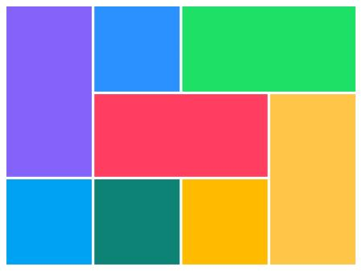

# easy.css
a free open source css library  with prebuilt class for free and pre built colors  
usage add this tag to start &lt;link rel="stylesheet" type="text/css" href="https://s0net.github.io/easy.css/style.css"&gt;

    
    <nav id="navbar">
        <h1>Documentation Menu</h1>
        <a href="#Intro">what is easy css</a> 
        <a href="#colors">easy css colors</a> 
        <a href="#center">center</a> 
        <a href="#b">bold</a> 
        <a href="#underline">underline</a> 
        <a href="#overline">overline</a> 
        <a href="#redtext">redtext</a> 
        <a href="#bluetext">bluetext</a> 
        <a href="#spinner">spinner</a> 
        <a href="#shake">shake</a> 
        <a href="#capitalcase">capitalcase</a> 
        <a href="#code">code</a> 
        <a href="#hide">hide</a> 
        <a href="#show">show</a> 
        <a href="#bigtext">bigtext</a> 
        <a href="#smalltext">smalltext</a> 
        <a href="#hidden_classses">challenge</a>
        </nav>
         
        

        <main>
            <section id="Intro">
                <h1>
                    What is easy.css?
                </h1>
                

                    easy css is a css library to make your html css better  
                

                <pre>class="center"</pre>
            </section>
            

            <section id="colors">
                <h1>
                    EASY.css Colors                
                </h1>
                <h2>
                    lavender 
                </h2>
                <pre>var(--lavender)</pre>
                <h2>
                    coolblue 
                </h2>
                <pre>var(--coolblue)</pre>
                <h2>
                    coolyellow 
                </h2>
                <pre>var(--coolyellow)</pre>
                <h2>
                    whatsapp_green 
                </h2>
                <pre>var(--whatsapp_green)</pre>
                <h2>
                    whatsapp_teal 
                </h2>
                <pre>var(--whatsapp_teal)</pre>
                <h2>
                    teal 
                </h2>
                <pre>var(--teal)</pre>
                <h2>
                    pink 
                </h2>
                <pre>var(--pink)</pre>
                <h2>
                    darkgrey 
                </h2>
                <pre>var(--darkgrey)</pre>
                <h2>
                    ligthgrey 
                </h2>
                <pre>var(--ligthgrey)</pre>
                <h2>
                    orange  
                </h2>
                <pre>var(--orange)</pre>
                <h2>
                    blue 
                </h2>
                <pre>var(--blue)</pre>
                <h2>
                    purple 
                </h2>
                <pre>var(--purple)</pre>
                <h2>
                    okblack 
                </h2>
                <pre>var(--okblack)</pre>
                <h2>
                    bluedark 
                </h2>
                <pre>var(--bluedark)</pre>
            </section>
            

            <section id="center">
                <h1>center</h1>
                
this is used to center a element both verticaly and horizontal

                <pre>&lt;h1 class="center"&gt;i am centered in the screen&lt;/h1&gt;</pre>
            </section>
            

            <section id="b">
                <h1>b</h1>
                
this is used to make the text inside a element bold

                <pre>&lt;h1 class="b"&gt;this text is bold&lt;/h1&gt;</pre>
            </section>
            

            <section id="underline">
                <h1>underline</h1>
                
this is used to underline the text inside a element

                <pre>&lt;h1 class="underline"&gt;this text is underlined&lt;/h1&gt;</pre>
            </section>
            

            <section id="overline">
                <h1>overline</h1>
                
this is used to overline the text inside a element

                <pre>&lt;h1 class="overline&gt;this text is underlined&lt;/h1&gt;</pre>
            </section>
            

            <section id="redtext">
                <h1>redtext</h1>
                
this is used to make text inside a element red in color

                <pre>&lt;h1 class="redtext&gt;this text is red&lt;/h1&gt;</pre>
            </section>
            

            <section id="bluetext">
                <h1>bluetext</h1>
                
this is used to make text inside a element blue in color

                <pre>&lt;h1 class="bluetext&gt;this text is blue&lt;/h1&gt;</pre>
            </section>
            

            <section id="spinner">
                <h1>spinner</h1>
                
this is used to make a spinner in html

                

                <pre>&lt;div class="spinner"&gt;this text is blue&lt;div&gt;</pre>
            </section>
            

            <section id="shake">
                <h1 class="shake">shake</h1>
                this is used to make a shake in html  
                <pre>&lt;span class="shake"&gt;this element can shake&lt;/span&gt;</pre>
            </section>
            

            <section id="capitalcase">
                <h1>capitalcase</h1>
                
this is used to make the text inside a element capitalcase

                <pre>&lt;span class="capitalcase"&gt;capitalcase&lt;/span&gt;</pre>
            </section>
            

            <section id="code">
                <h1>code</h1>
                
this is used to show a code element

                <pre>&lt;span class="code"&gt;code&lt;/span&gt;</pre>
            </section>
            

            <section id="hide">
                <h1>hide</h1>
                
this is used to hide a element

                <pre>&lt;span class="hide"&gt;hide&lt;/span&gt;</pre>
            </section>
            

            <section id="show">
                <h1>show</h1>
                
this is used to show a element

                <pre>&lt;span class="show"&gt;show&lt;/span&gt;</pre>
            </section>
            

            <section id="goodfont">
                <h1>goodfont</h1>
                
this is used to apply the monospace font family

                <pre>&lt;span class="goodfont"&gt;goodfont example&lt;/span&gt;</pre>
            </section>
            

            <section id="bigtext">
                <h1>bigtext</h1>
                
this is used to apply the font-size to xx-large

                <pre>&lt;span class="bigtext"&gt;bigtext example&lt;/span&gt;</pre>
            </section>
            

            <section id="smalltext">
                <h1>smalltext</h1>
                
this is used to apply the font-size to small

                <pre>&lt;span class="smalltext"&gt;smalltext example&lt;/span&gt;</pre>
            </section>
            

            <section id="hidden_classses">
                <h1>One More Thing</h1>
                

                    this is <b>NOT</b> a class given here  
                    to find it go to <a href="https://s0net.github.io/easy.css/style.css">s0net.github.io/easy.css/style.css</a>   
                    and check the only one class that has not been used here if you find it  
                    go to  <a href="https://github.com/s0net/easy.css/edit/main/index.html" target="_blank" class="github">github</a> and add it here 
                

            </section>
            <b>
            found a problem fix on <a href="https://github.com/s0net/easy.css" target="_blank" class="github">GITHUB</a>
            </b>
        </main>
    
